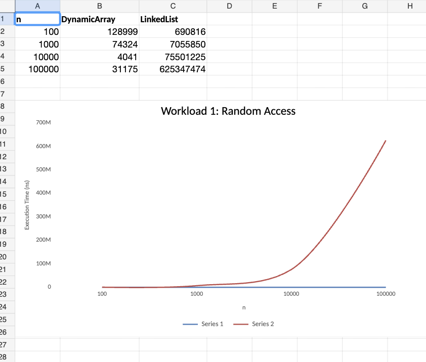
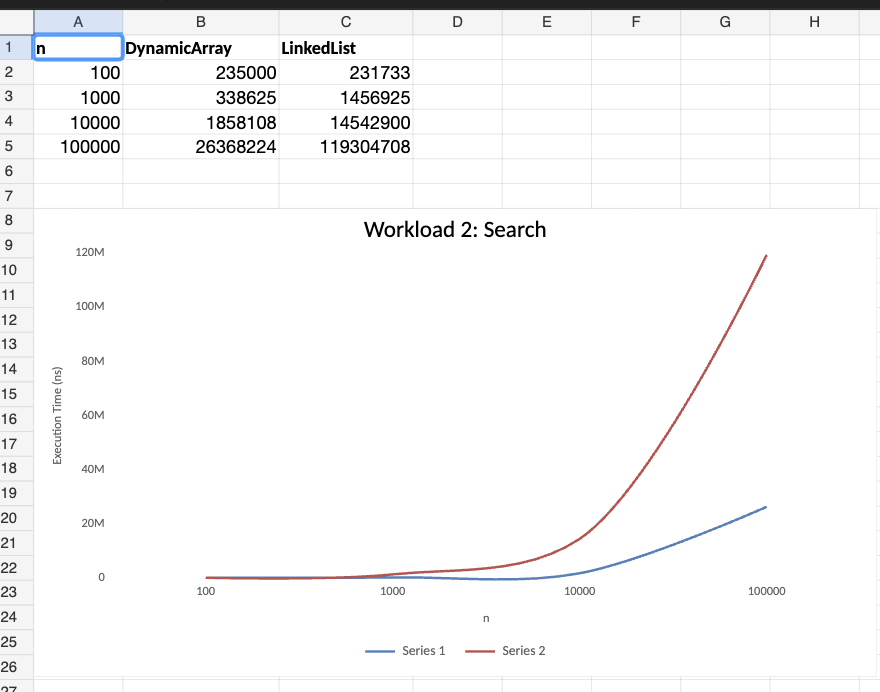
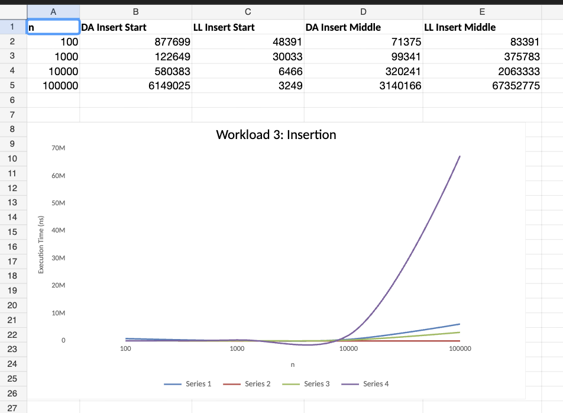
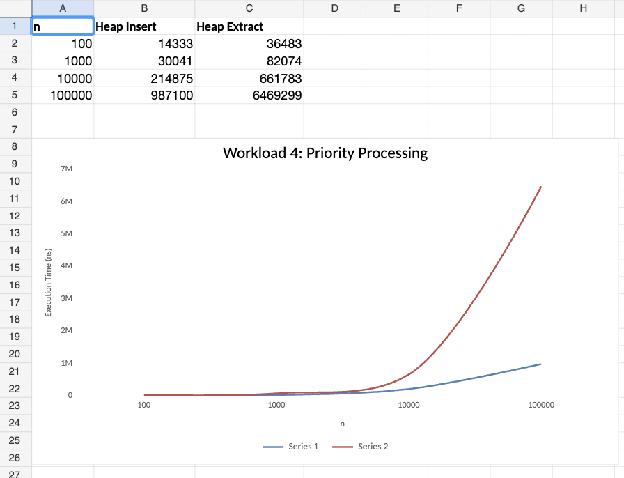

# Assignment 2: Algorithmic Analysis, Correctness and Performance Trade-offs

**Group:** SE-2539
**Name:** Khanzada Nyshanbek Adilqyzy

## 1. Overview

This assignment focuses on algorithmic analysis, correctness, benchmarking, and performance comparison.

Three data structures were implemented from scratch:

Dynamic Array

Linked List

Min-Heap

The main purpose of the assignment is to analyze the algorithms using O, Ω, and Θ notation, prove correctness using loop invariants, design controlled workloads, and compare theoretical complexity with measured performance.

The project is implemented in Java.

The experiments use four workloads with different input sizes. Execution time and additional metrics such as element accesses and comparisons are recorded.

## 2. Project Structure

```text
DAA_asik2/
├── src/
│   ├── DynamicArray.java
│   ├── LinkedList.java
│   ├── MinHeap.java
│   ├── Benchmark.java
│   ├── Tests.java
│   └── Main.java
│
├── results/
│   ├── tables/
│   │   ├── workload1.csv
│   │   ├── workload2.csv
│   │   ├── workload3.csv
│   │   └── workload4.csv
│   ├── plots/
│   │   ├── 1graf.png
│   │   ├── 2graf.png
│   │   ├── 3graf.png
│   │   └── 4graf.png
│   ├── plot.py
│   └── print_md_tables.py
│
├── pom.xml
└── README.md
```

`Main.java` is the default IntelliJ IDEA entry point and is not used by the tests or the benchmark.

### 2.1 Build and Run

The project was developed with JDK 25 in IntelliJ IDEA (`pom.xml` sets Java 25). JDK 25 is required to compile `Main.java`, because it uses features that are new in Java 25. The other classes use only the standard library.

In IntelliJ IDEA, run the `main` method of `Tests` or `Benchmark`.

From the command line, in the repository root:

```text
javac -d out src/*.java

java -cp out src.Tests          # correctness tests
java -cp out src.Benchmark      # benchmark, writes results/tables/*.csv
```

With an older JDK, compile everything except `Main.java`:

```text
javac -d out src/DynamicArray.java src/LinkedList.java src/MinHeap.java src/Tests.java src/Benchmark.java
```

The benchmark must be started from the repository root, because it writes to the relative path `results/tables/`.

The plots and the Markdown tables of this report are produced from the CSV files with Python (pandas and matplotlib are required):

```text
python3 results/plot.py               # creates results/plots/*.png
python3 results/print_md_tables.py    # prints the tables used in sections 7-10
```

## 3. Implemented Data Structures

### 3.1 Dynamic Array

The Dynamic Array stores elements in a contiguous array.

The implemented operations are:

```text
add(x)
add(index, x)
remove(index)
get(index)
contains(x)
```

The array automatically increases its capacity when more space is required.

The capacity is increased by creating a larger array and copying the existing elements. The new capacity is the larger of the required size and twice the old capacity.

### 3.2 Linked List

The Linked List stores elements in nodes.

Each node contains a value and a reference to the next node.

The implementation also keeps references to the head and tail nodes.

The implemented operations are:

```text
add(x)
add(index, x)
remove(index)
get(index)
contains(x)
```

### 3.3 Min-Heap

The Min-Heap is implemented using an array.

The minimum element is stored at the root of the heap.

The implemented operations are:

```text
insert(x)
peekMin()
extractMin()
```

The heap property is maintained after insertion using sift-up and after extraction using sift-down.

The array grows in the same way as in the Dynamic Array (capacity doubling).

## 4. Complexity Analysis

### 4.1 Dynamic Array

| Operation     | Best Case | Average Case | Worst Case | Auxiliary Space |
| ------------- | --------- | ------------ | ---------- | --------------- |
| add(x)        | Ω(1)      | Θ(1)         | O(n)       | O(n)            |
| add(index, x) | Ω(1)      | Θ(n)         | O(n)       | O(n)            |
| remove(index) | Ω(1)      | Θ(n)         | O(n)       | O(1)            |
| get(index)    | Ω(1)      | Θ(1)         | O(1)       | O(1)            |
| contains(x)   | Ω(1)      | Θ(n)         | O(n)       | O(1)            |

The get(index) operation directly accesses an array position, so it takes constant time.

The add(x) operation is normally constant time. When the internal array becomes full, resizing and copying elements requires O(n) time. The average case Θ(1) is an amortized bound: the capacity is doubled, so n consecutive add(x) calls copy fewer than 2n elements in total.

The add(index, x) operation may need to move all elements after the selected index. Therefore, its worst-case complexity is O(n). Its best case Ω(1) is insertion at the end.

The remove(index) operation may also need to move elements to fill the removed position, so its worst-case complexity is O(n). Its best case Ω(1) is removal of the last element.

The contains(x) operation searches elements one by one. It can finish immediately if the value is at the beginning, but in the worst case all elements must be checked.

Auxiliary space: the operations that can trigger resizing (add(x) and add(index, x)) allocate a new array of size O(n), so their auxiliary space is O(n). The other operations use O(1) additional memory.

### 4.2 Linked List

| Operation     | Best Case | Average Case | Worst Case | Auxiliary Space |
| ------------- | --------- | ------------ | ---------- | --------------- |
| add(x)        | Ω(1)      | Θ(1)         | O(1)       | O(1)            |
| add(index, x) | Ω(1)      | Θ(n)         | O(n)       | O(1)            |
| remove(index) | Ω(1)      | Θ(n)         | O(n)       | O(1)            |
| get(index)    | Ω(1)      | Θ(n)         | O(n)       | O(1)            |
| contains(x)   | Ω(1)      | Θ(n)         | O(n)       | O(1)            |

The add(x) operation is constant time because the implementation keeps a tail reference.

For add(index, x), the list usually needs to traverse nodes until the required position is reached. Therefore, the worst case is O(n). Insertion at the beginning or at the end is O(1).

The same traversal is required for remove(index). Removal of the first element is O(1).

The get(index) operation is O(n) because the list does not support direct indexing. The average distance for a random index is about n / 2.

The contains(x) operation checks nodes sequentially, so the worst case is O(n).

### 4.3 Min-Heap

| Operation    | Best Case | Average Case | Worst Case | Auxiliary Space |
| ------------ | --------- | ------------ | ---------- | --------------- |
| insert(x)    | Ω(1)      | Θ(1)         | O(log n)   | O(n)            |
| peekMin()    | Ω(1)      | Θ(1)         | O(1)       | O(1)            |
| extractMin() | Ω(1)      | Θ(log n)     | O(log n)   | O(1)            |

The insert(x) operation places the new element at the end and moves it upward when necessary. The height of a binary heap is O(log n), so the worst case (for example, inserting values in decreasing order, where every new element climbs to the root) is O(log n). The best case is Ω(1), when the new element is not smaller than its parent.

For randomly ordered input the average case is Θ(1). Half of all nodes are leaves and a quarter are just above the leaves, so a new element usually stops after very few steps and the expected number of levels climbed is constant. This is confirmed by Workload 4, where the number of comparisons per insert stays at about 2.3 for every n from 1000 to 100000.

Auxiliary space of insert(x) is O(n) for the same reason as in the Dynamic Array: the internal array can be reallocated when it is full.

The peekMin() operation returns the root element, so it takes constant time.

The extractMin() operation removes the root and restores the heap property using sift-down. The element moved to the root comes from the last level, so it usually sinks almost to the bottom again. Therefore, the average and the worst case are both Θ(log n) (at most two comparisons per level). The best case is Ω(1), for example when all elements are equal.

## 5. Correctness

Two non-trivial operations were selected for loop-invariant correctness proofs.

The first operation is Dynamic Array add(index, x).

The second operation is Min-Heap extractMin().

### 5.1 Dynamic Array add(index, x)

The operation shifts elements to the right before placing the new element at the required index.

Relevant code:

```java
resize(size + 1);
for (int i = size; i > index; i--) {
    data[i] = data[i - 1];
}
data[index] = x;
size++;
```

Let `n` be the value of `size` on entry and let `A[0..n-1]` be the original elements. After `resize`, the array has room for at least `n + 1` elements and `data[0..n-1] = A[0..n-1]`.

#### Loop Invariant

Whenever the loop condition is tested with the current value of `i`:

1. `data[k] = A[k-1]` for every `k` with `i < k <= n` (elements that were already shifted one position to the right);
2. `data[k] = A[k]` for every `k` with `0 <= k <= i` and `k < n` (elements that were not touched yet).

#### Initialization

Before the first iteration `i = n`. Part 1 concerns an empty range (`n < k <= n`), so it is true. Part 2 is true because nothing has been written yet and `data[0..n-1] = A[0..n-1]`. Writing to `data[n]` is safe because `resize` guaranteed capacity for `n + 1` elements.

#### Maintenance

Assume the invariant holds and the loop body runs, so `i > index >= 0`. The body executes `data[i] = data[i-1]`. Since `i - 1 <= i` and `i - 1 < n`, part 2 gives `data[i-1] = A[i-1]`. Therefore, after the assignment `data[i] = A[i-1]`, so part 1 now also holds for `k = i`. Only `data[i]` was written, so part 2 still holds for all `k <= i - 1`. After `i--` the invariant holds for the new value of `i`.

#### Termination

Every iteration decreases `i` by exactly 1 and the loop runs while `i > index`. Therefore, it stops after exactly `n - index` iterations with `i = index`.

#### Correctness

At termination the invariant with `i = index` says: `data[k] = A[k-1]` for `index < k <= n`, and `data[k] = A[k]` for `k < index`. The old value `A[index]` is still stored at position `index + 1`, so writing `x` into `data[index]` loses nothing. The array now contains `A[0..index-1], x, A[index..n-1]`, and `size` becomes `n + 1`. This is exactly the original sequence with `x` inserted at position `index`.

Therefore, `add(index, x)` correctly inserts the new element.

### 5.2 Min-Heap extractMin()

The extractMin() operation removes the root and restores the heap property using sift-down.

Relevant code (`down(i)` swaps the element at `i` with its smaller child while that child is smaller than the element):

```java
int min = data[0];
size--;
data[0] = data[size];
if (size > 0) down(0);
return min;
```

#### Loop Invariant

At the start of every iteration of the sift-down loop, with current position `i`:

1. every parent-child pair satisfies `data[parent] <= data[child]`, except possibly the pairs `(i, left(i))` and `(i, right(i))`;
2. if `i` has a parent `p`, then `data[p] <= data[c]` for both children `c` of `i`.

#### Initialization

Before the first iteration `i = 0`. The heap was valid before the operation and only `data[0]` was replaced by the last element. Therefore, only the pairs that contain the root can be violated, and these are exactly `(0, left(0))` and `(0, right(0))`. All other pairs are inside the two untouched subtrees, so part 1 holds. The root has no parent, so part 2 holds trivially.

#### Maintenance

Let `v = data[i]` and let `m` be the smaller child, stored at position `s`. If `v <= m` or `i` has no children, the loop stops (see Termination). Otherwise the loop swaps `data[i]` and `data[s]`, so position `i` now holds `m`:

- pair `(p, i)`: `data[p] <= m` by part 2 of the invariant;
- pair `(i, other child)`: `m` is not larger than the other child, because `m` was the smaller child;
- pairs `(s, children of s)`: before the swap they were valid (they are not excluded by part 1, because `s != i`), so `m` is not larger than the children of `s`. After the swap position `s` holds `v`, which is larger than `m` and may be larger than its own children. So only these two pairs of `s` can be violated, which is exactly what part 1 allows for the new position `s`;
- part 2 for the new position `s`: its parent `i` now holds `m`, and `m` is not larger than the children of `s`, as shown above.

All other pairs were not changed, so the invariant holds with `i = s`.

#### Termination

Each iteration moves `i` from a node to one of its children, so the depth of `i` increases by 1. A heap with `size` elements has height at most `floor(log2(size))`, therefore the loop runs at most that many times. It stops when `v <= m` or when `i` is a leaf.

#### Correctness

When the loop stops, either `i` is a leaf or `v` is not larger than both children, so the pairs excluded in part 1 are also valid. Hence every parent-child pair satisfies the heap property and the remaining `size` elements form a min-heap. The returned value was `data[0]` before the operation, which is the minimum by the heap property, and the remaining elements are the original elements without it.

Therefore, `extractMin()` correctly removes and returns the minimum element.

## 6. Experimental Setup

The experiments were performed in Java using `System.nanoTime()`.

The input sizes were:

```text
100
1000
10000
100000
```

Each experiment was repeated 5 times.

The average execution time was calculated from the five runs.

The benchmark uses a fixed random seed with the base value 42:

```text
Random(42 + run),  run = 0, 1, 2, 3, 4
```

Therefore, the data is always the same and the results can be reproduced. The five runs use five different data sets, so the counters (accesses and comparisons) in the tables are also averages over these five runs.

Input data was generated before the timed section.

Input generation was not included in the measured execution time.

Printing was not included in the measured execution time.

The benchmark records execution time and additional metrics required by each workload.

The value of `m` depends on the workload.

For Workload 1:

```text
m = 10000 get operations
```

For Workload 2:

```text
m = 1000 search operations
```

For Workload 3:

```text
m = 1000 insertions and 1000 removals
```

For Workload 4:

```text
m = n insertions and n extractions
```

The benchmark does not contain a separate JVM warm-up phase. Therefore, the JIT compiler may still be compiling the code during the first (smallest) input sizes, and these measurements can be slower than the measurements for larger n (see section 11.3). The operation counters do not depend on the JVM, so they are used as the main evidence, and the times as supporting evidence.

Environment:

```text
JDK: OpenJDK 25 (IntelliJ IDEA)
OS:  macOS
```

Absolute times depend on the machine, so the report compares growth trends and operation counts, not absolute values.

## 7. Workload 1: Random Access

The first workload compares `get(index)` for Dynamic Array and Linked List.

For each input size, a structure containing n random integers was created.

Then 10000 random indexes were generated.

The `get(index)` operation was performed for every generated index.

The total execution time and number of element accesses were recorded.

### Theoretical Analysis

Dynamic Array:

```text
get(index) = Θ(1)
```

Linked List:

```text
get(index) = Θ(n)
```

Dynamic Array can directly access an array position.

Linked List must start from the head and follow nodes until the required index is reached.

### Results

| n | Dynamic Array Time (ns) | Dynamic Array Accesses | Linked List Time (ns) | Linked List Accesses |
| ---: | ---: | ---: | ---: | ---: |
| 100 | 264225 | 10000 | 1235858 | 506935 |
| 1000 | 116833 | 10000 | 9108783 | 5004956 |
| 10000 | 21574 | 10000 | 94208066 | 50080614 |
| 100000 | 53991 | 10000 | 709683533 | 499473863 |

The number of Dynamic Array accesses remains 10000 because every get operation uses direct indexing.

The number of Linked List accesses increases approximately linearly with n because each random access requires traversal. It is about n / 2 accesses per `get`, which is the expected average distance for random indexes (for n = 100000: 499473863 / 10000 ≈ 49950).

The Linked List time grows accordingly, roughly in proportion to n: 9.1 ms for n = 1000, 94.2 ms for n = 10000 and 709.7 ms for n = 100000.

The Dynamic Array time does not grow with n in a meaningful way, and it is not even ordered (264 µs for n = 100, 22 µs for n = 10000). The total time of 10000 `get` calls is very small, so a single run is easily disturbed by JIT compilation and garbage collection, especially for the smallest inputs. The access counter shows the real behaviour: exactly 10000, one per `get`.

### Graph

The graph was created with `results/plot.py` from `results/tables/workload1.csv`. Both axes are logarithmic.



## 8. Workload 2: Search

The second workload compares `contains(value)` for Dynamic Array and Linked List.

For every input size, 1000 search values were generated.

The `contains(value)` operation was performed for every search value.

The total execution time and number of comparisons were recorded.

### Theoretical Analysis

Both structures perform sequential search.

Therefore:

```text
Best case = Ω(1)
Average case = Θ(n)
Worst case = O(n)
```

### Results

| n | Dynamic Array Time (ns) | Dynamic Array Comparisons | Linked List Time (ns) | Linked List Comparisons |
| ---: | ---: | ---: | ---: | ---: |
| 100 | 248566 | 100000 | 238625 | 100000 |
| 1000 | 416583 | 1000000 | 1613383 | 1000000 |
| 10000 | 2002408 | 10000000 | 17369191 | 10000000 |
| 100000 | 34295574 | 100000000 | 163987091 | 100000000 |

The number of comparisons increases linearly with n and is exactly m · n = 1000 · n for both structures.

For n = 100000, both structures performed 100000000 comparisons.

The search values are random 32-bit integers, so almost every value is not present in the structure and every `contains` call scans all n elements. Therefore, this workload measures the worst case O(n) (a search that finds the value early would be closer to the best case Ω(1)).

Both structures do the same number of comparisons, but for n ≥ 1000 the Dynamic Array is about 4 to 9 times faster (34.3 ms and 164.0 ms for n = 100000). The elements of the array are stored next to each other in memory, while the Linked List must follow references to nodes that can be far apart. This is a constant-factor difference; the asymptotic complexity is the same. For n = 100 the times are almost equal (249 µs and 239 µs), because the total time is too small to be measured reliably.

### Graph



## 9. Workload 3: Insertion and Removal

The third workload compares insertion and removal for Dynamic Array and Linked List.

For each input size, 1000 operations were performed at the beginning and at the middle position.

The number of accesses and execution time were recorded.

The middle position was calculated as:

```text
index = n / 2
```

For removal, the middle is recalculated for the current size before every operation.

### Theoretical Analysis

For Dynamic Array, insertion and removal may require shifting elements.

Therefore:

```text
Beginning: O(n)
Middle: O(n)
```

For Linked List, insertion and removal at the beginning can be performed by changing references.

Therefore:

```text
Beginning: O(1)
```

For the middle position, traversal is required before changing the links.

Therefore:

```text
Middle: O(n)
```

### Results

| n | Structure | Operation | Position | Time (ns) | Accesses |
| ---: | :--- | :--- | :--- | ---: | ---: |
| 100 | Dynamic Array | insert | start | 931041 | 1200000 |
| 100 | Dynamic Array | remove | start | 1234233 | 1201000 |
| 100 | Dynamic Array | insert | middle | 83049 | 1100000 |
| 100 | Dynamic Array | remove | middle | 59133 | 601000 |
| 100 | Linked List | insert | start | 48949 | 0 |
| 100 | Linked List | remove | start | 40333 | 1000 |
| 100 | Linked List | insert | middle | 98658 | 51000 |
| 100 | Linked List | remove | middle | 582016 | 301000 |
| 1000 | Dynamic Array | insert | start | 131591 | 3000000 |
| 1000 | Dynamic Array | remove | start | 85225 | 3001000 |
| 1000 | Dynamic Array | insert | middle | 103758 | 2000000 |
| 1000 | Dynamic Array | remove | middle | 75499 | 1501000 |
| 1000 | Linked List | insert | start | 34999 | 0 |
| 1000 | Linked List | remove | start | 22800 | 1000 |
| 1000 | Linked List | insert | middle | 450508 | 501000 |
| 1000 | Linked List | remove | middle | 1102466 | 751000 |
| 10000 | Dynamic Array | insert | start | 598892 | 21000000 |
| 10000 | Dynamic Array | remove | start | 430174 | 21001000 |
| 10000 | Dynamic Array | insert | middle | 322841 | 11000000 |
| 10000 | Dynamic Array | remove | middle | 212833 | 10501000 |
| 10000 | Linked List | insert | start | 4850 | 0 |
| 10000 | Linked List | remove | start | 5000 | 1000 |
| 10000 | Linked List | insert | middle | 3032183 | 5001000 |
| 10000 | Linked List | remove | middle | 6956591 | 5251000 |
| 100000 | Dynamic Array | insert | start | 10732266 | 201000000 |
| 100000 | Dynamic Array | remove | start | 8617300 | 201001000 |
| 100000 | Dynamic Array | insert | middle | 5519158 | 101000000 |
| 100000 | Dynamic Array | remove | middle | 4667983 | 100501000 |
| 100000 | Linked List | insert | start | 4033 | 0 |
| 100000 | Linked List | remove | start | 2625 | 1000 |
| 100000 | Linked List | insert | middle | 71746058 | 50001000 |
| 100000 | Linked List | remove | middle | 71273058 | 50251000 |

The results show that Dynamic Array performs many element movements when inserting or removing at the beginning: about n movements per operation, at 2 counted accesses per moved element (201000000 accesses for 1000 insertions at n = 100000). In the middle it moves about n / 2 elements, which gives about half of the accesses (101000000).

Linked List needs no traversal at the beginning. For removal exactly one access per operation is counted (1000 for 1000 operations). For insertion at the beginning the implementation does not count any access, which is why the table shows 0; the operation only changes the head reference, so it is O(1).

For middle operations, Linked List requires traversal, so the number of accesses increases with n: about n / 2 per operation (50001000 accesses for n = 100000).

For n = 100000 the operations at the beginning are more than 1000 times faster for the Linked List (4 µs against 10.7 ms for insertion and 2.6 µs against 8.6 ms for removal).

In the middle, the Linked List made about half as many counted accesses as the Dynamic Array (50001000 against 101000000), but it was still about 13 to 15 times slower (71.7 ms and 71.3 ms against 5.5 ms and 4.7 ms). Shifting elements in an array is a sequential memory copy, while traversing a list is pointer chasing through memory. The access counts show the asymptotic behaviour, but they do not show the real cost of one access.

Some times for small n look wrong (for example, the Dynamic Array insertion at the beginning for n = 100 takes 931 µs, and 132 µs for n = 1000). This is the same JIT and measurement noise as in Workload 1 (see section 11.3).

### Graph



## 10. Workload 4: Priority Processing

The fourth workload evaluates the Min-Heap.

For each input size, n random integers were generated.

All values were inserted into an empty Min-Heap.

After all insertions, the minimum element was extracted n times.

Insertion time, extraction time, and comparisons were recorded.

The extracted values were also checked to make sure they were in non-decreasing order.

### Theoretical Analysis

The complexity of Min-Heap operations is:

```text
insert(x)    = O(log n) worst case, Θ(1) average case for random input
peekMin()    = O(1)
extractMin() = Θ(log n) average and worst case
```

The heap height is logarithmic, so sift-up and sift-down require at most O(log n) levels. Sift-up on random data usually stops after very few steps, while sift-down usually goes almost to the bottom.

### Results

| n | Insert Time (ns) | Extract Time (ns) | Insert Comparisons | Extract Comparisons | Total Comparisons | Non-Decreasing |
| ---: | ---: | ---: | ---: | ---: | ---: | :--- |
| 100 | 14416 | 36666 | 201 | 852 | 1053 | true |
| 1000 | 31483 | 80733 | 2238 | 15001 | 17239 | true |
| 10000 | 236241 | 738742 | 22683 | 216600 | 239283 | true |
| 100000 | 1123175 | 6990274 | 228142 | 2831649 | 3059791 | true |

The results show two different patterns.

The comparisons per `insert` stay almost constant: 2.01 for n = 100, and about 2.3 for n = 1000, 10000 and 100000. This agrees with the average case Θ(1) for random input.

The comparisons per `extractMin` grow by about 6.6 for every 10 times larger n (8.5, 15.0, 21.7, 28.3). This is 2 · log2(10) and agrees with Θ(log n) with two comparisons per level.

Therefore, extraction is more expensive than insertion: for n = 100000 it needs 12.4 times more comparisons and 6.2 times more time (7.0 ms and 1.1 ms).

The `nonDecreasing` value is true for every tested input size, which confirms that `extractMin()` returns elements in the required order.

### Graph

The right part of the graph shows the comparisons per operation. The dashed line is the reference 2 · log2(n).



## 11. Performance and Design Analysis

### 11.1 How does increasing n affect each workload?

Increasing n increases the amount of work for operations with linear or logarithmic complexity.

The strongest increase can be seen in Linked List random access because every access may require traversing many nodes (0.7 seconds for 10000 accesses at n = 100000).

Search also requires more comparisons as n increases: exactly 1000 · n for both structures.

Insertion and removal at the beginning of Dynamic Array require more element movements for larger n, while the same operations in the Linked List do not depend on n.

In the Min-Heap the comparisons per extraction grow logarithmically, and the comparisons per insertion stay almost constant.

### 11.2 Which experimental results agree with theoretical complexity?

The Random Access workload agrees strongly with theory.

Dynamic Array performs a constant number of counted accesses for every n, while Linked List accesses increase with n (about n / 2 per `get`).

Search results also agree with the theoretical O(n) complexity because the number of comparisons increases linearly.

Workload 3 agrees with the expected difference between array shifting (about n and n / 2 moved elements) and linked-list traversal (constant at the beginning, about n / 2 in the middle).

Min-Heap results agree with theory: about 2 · log2(n) comparisons per extraction, and a constant number of comparisons per insertion on random data.

### 11.3 Where can experimental results differ from theoretical prediction?

Measured execution time can contain noise caused by the JVM, CPU cache, garbage collection, memory allocation, operating system activity, and other running processes.

Very fast operations can also be affected by measurement overhead.

This can be seen in the results. For example, 10000 Dynamic Array `get` calls take 264 µs for n = 100, 117 µs for n = 1000 and 22 µs for n = 10000, although every case performs exactly 10000 accesses. The benchmark has no warm-up phase, so the first (smallest) cases are measured while the JIT compiler is still working. The same effect is visible in Workload 3 for n = 100.

For this reason, theoretical complexity is better evaluated together with operation counts and repeated measurements instead of using execution time alone. In this report the counters are the main evidence, and the times are used to compare the growth trend for larger n.

### 11.4 Why can two algorithms with the same Big-O complexity have different running times?

Big-O describes the growth rate of an algorithm.

It does not describe every constant factor.

Two O(n) algorithms can perform different numbers of instructions, memory accesses, pointer operations, or data movements.

Therefore, their real execution times can be different even though they have the same asymptotic complexity.

Example from the experiments: the search in Dynamic Array and in Linked List performs exactly the same number of comparisons, but for n = 100000 the Linked List needs 164.0 ms and the Dynamic Array only 34.3 ms.

### 11.5 How do constant factors and implementation details affect performance?

Implementation details can change the actual running time.

Dynamic Array uses contiguous memory and direct indexing.

Linked List uses nodes and references between nodes.

These different memory organizations affect memory access and cache behavior. In Workload 3 (middle position, n = 100000) the Linked List makes half as many counted accesses as the Dynamic Array, but is 13 to 15 times slower.

The JVM can also optimize frequently executed code during the benchmark.

### 11.6 Why is Dynamic Array preferable for some workloads?

Dynamic Array is useful when the program performs many indexed accesses.

The `get(index)` operation has Θ(1) complexity.

This makes Dynamic Array suitable when fast random access is important.

It is also faster for sequential search and for insertion or removal in the middle, because its elements are stored contiguously (Workloads 2 and 3).

### 11.7 When can a Linked List be useful?

Linked List can be useful when many insertions or removals happen at the beginning and indexed access is not the main requirement.

The implementation can change the head reference without shifting all existing elements. In Workload 3 this is more than 1000 times faster than the Dynamic Array for n = 100000.

### 11.8 Why is a Heap appropriate for priority-based processing?

A Min-Heap keeps the minimum element at the root.

`peekMin()` takes O(1) time.

`insert()` takes O(log n) in the worst case (and constant time on average for random data), and `extractMin()` takes O(log n).

Finding the minimum in an unsorted Dynamic Array or Linked List would need n comparisons every time, while the heap needs about 2 · log2(n) (28 comparisons for n = 100000).

This makes the structure suitable for processing elements according to priority.

### 11.9 How does the workload influence the choice of data structure?

Different workloads require different operations.

A workload with frequent indexed access benefits from Dynamic Array.

A workload with frequent operations at the beginning can use Linked List.

A workload that repeatedly needs the minimum-priority element can use Min-Heap.

Therefore, the workload and the frequency of operations should be considered when selecting a data structure.

## 12. Testing and Correctness Validation

The project contains a `Tests` class for correctness validation.

The tests include:

```text
Empty structure
One element
Multiple elements
Duplicate values
Insertion at the beginning
Insertion in the middle
Insertion at the end
Removal
Boundary indexes
Invalid indexes
Large inputs
```

For Min-Heap, the tests also verify:

```text
Minimum element
Heap extraction
Non-decreasing extraction order
Large heap
```

The test program completed successfully.

### Test Output

The following screenshot shows the test results:


```text
Passed: 33
Failed: 0
All tests passed!
```

## 13. Benchmark Output

The benchmark was executed for all four workloads.

The following screenshot shows the benchmark execution:


The benchmark generated four CSV result files:

```text
results/tables/workload1.csv
results/tables/workload2.csv
results/tables/workload3.csv
results/tables/workload4.csv
```

The tables in sections 7-10 are copied from these CSV files.

## 14. Experimental Results and Plots

The benchmark tables are stored in the `results/tables/` directory.

The graphs were created from these CSV files by `results/plot.py` (Python, pandas, matplotlib). To create them again, run the benchmark and then `python3 results/plot.py`.

### Workload 1


### Workload 2


### Workload 3


### Workload 4


## 15. Design Recommendations

The results show that the choice of data structure depends on the workload.

Dynamic Array is appropriate when direct indexed access is frequently required. It is also the better choice for searching and for changes in the middle of the sequence.

Linked List can be useful when operations are concentrated at the beginning of the structure.

Min-Heap is appropriate for priority-based processing where the minimum element must be repeatedly accessed and removed. It needs about 2.3 comparisons per insertion and about 2 · log2(n) comparisons per extraction.

The theoretical complexity and the measured workload should both be considered when choosing a data structure.

## 16. Conclusion

This assignment demonstrated the relationship between theoretical algorithmic complexity and practical performance.

Dynamic Array provided constant-time indexed access, while Linked List required traversal for indexed access.

Both Dynamic Array and Linked List required linear search for `contains(value)` in the implemented structures.

Dynamic Array insertion and removal can require many element movements.

Linked List can perform operations at the beginning without moving all existing elements, but middle operations require traversal.

Min-Heap provided efficient priority processing: extraction is Θ(log n), insertion is O(log n) in the worst case and about constant on average for random data, and access to the minimum element is O(1).

The operation counters agree with the theoretical complexity analysis in all four workloads.

The experiments also demonstrated that input size, workload, memory organization, implementation details, and JVM behavior can affect measured execution time.

## 17. Deliverables

The repository contains:

```text
README.md
Source code
Benchmark results
CSV tables
Performance graphs
Tests
```

All implemented classes compile and run successfully with JDK 25 (`Main.java` requires JDK 25; the other classes compile with older versions as well).

The test program completed with 33 passed tests and 0 failed tests.